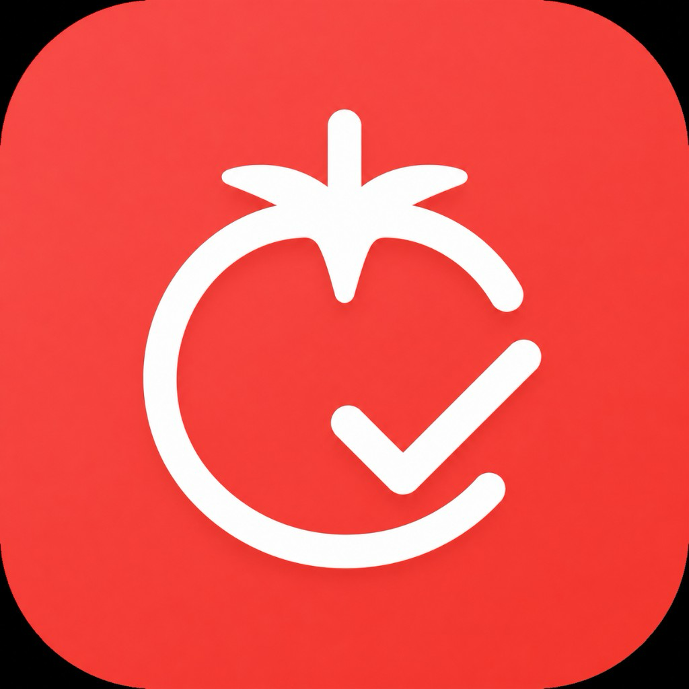
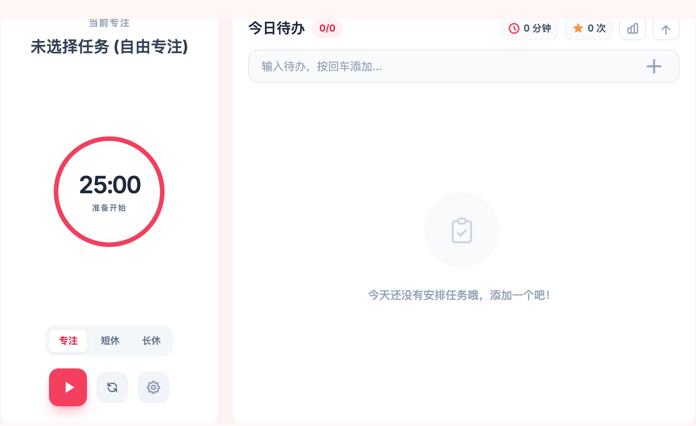
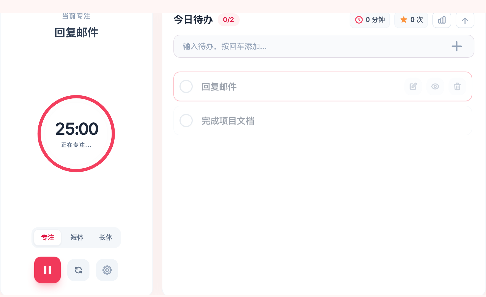
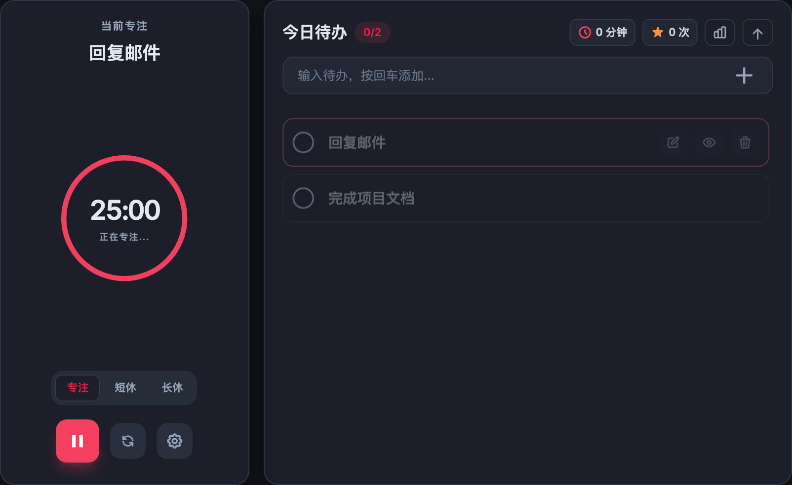

# Flow State 番茄钟

<p align="center">
  
</p>

<p align="center">
  轻量 macOS 桌面番茄钟 + 待办清单，支持缩为桌面小组件。<br>
  原生 Swift 壳 + Web 业务层，数据仅存本地，无需账号。
</p>

<p align="center">
  <strong>macOS 13+ · Apple Silicon (arm64)</strong><br>
  <a href="README.en.md">English README</a> ·
  <a href="VIBECODING.md">Vibecoding 实践指南</a>
</p>

---

## 功能特性

- **番茄钟**：专注 / 短休 / 长休，可自定义专注时长
- **墙钟计时**：基于系统时间戳，小组件模式下也不会严重漂移
- **今日待办**：添加、完成、编辑、删除；可选为当前专注目标
- **专注统计**：今日时长与次数，历史记录可查看
- **桌面小组件**：缩为 72×72 小窗，显示倒计时与待办进度，可拖拽
- **界面缩放**：窗口自适应 + 设置内 70%～130% 缩放（`⌘ +` / `⌘ -` / `⌘ 0`）
- **深色模式**：跟随 macOS 系统外观自动切换
- **本地存储**：任务与统计保存在 WebKit `localStorage`，不上传云端

## 截图

| 展开模式 | 待办与计时中 |
|---------|-------------|
|  |  |

| 深色模式 | 桌面小组件 |
|---------|-----------|
|  |  |

也可在 [Releases](https://github.com/DuffyRen/flow-state/releases) 下载预构建的 `.app` 包。

## 快速开始

### 下载发布版

从 [Releases](https://github.com/DuffyRen/flow-state/releases) 下载最新的 **`Flow-State-*-macos-arm64.zip`**，解压后将 **Flow State.app** 拖入「应用程序」文件夹。

### 环境要求

- macOS 13.0 或更高
- Apple Silicon (arm64)
- [Xcode Command Line Tools](https://developer.apple.com/xcode/resources/)（提供 `swiftc`、`sips`、`iconutil`）
- Node.js 18+（仅开发 / 测试时需要）

### 从源码构建

```bash
git clone https://github.com/DuffyRen/flow-state.git
cd flow-state

# 构建桌面 App（默认输出到 dist/Flow State.app）
./build.sh

# 启动
open "dist/Flow State.app"
```

可将 `dist/Flow State.app` 拖到「应用程序」文件夹长期使用。

自定义输出路径：

```bash
FLOW_STATE_APP_PATH="$HOME/Desktop/Flow State.app" ./build.sh
```

### 开发时启动

```bash
./start.sh
```

若尚未构建，会自动尝试执行 `build.sh`；失败时回退用 Safari 打开 HTML 页面。

## 项目结构

```
flow-state/
├── code_artifact.html    # 主界面（番茄钟 + 待办 + 弹窗）
├── lib/
│   ├── flow-tasks.js     # 待办归档、日期等纯逻辑
│   └── flow-timer.js     # 计时器、缩放等纯逻辑
├── native/
│   ├── main.swift        # macOS 窗口壳、小组件、JS 桥接
│   └── Info.plist
├── assets/
│   └── app-icon.png      # 应用图标源图（1024×1024 PNG）
├── tests/
│   ├── unit/             # Node 单元测试
│   ├── static/           # HTML / Swift 静态检查
│   ├── e2e/              # Playwright 冒烟测试
│   └── build/            # Swift 编译验证
├── docs/                 # 技术架构与测试用例文档
├── build.sh              # 一键构建 .app
├── test.sh               # 一键运行全部测试
├── start.sh              # 启动脚本
└── package.json          # E2E 测试依赖
```

## 开发流程

1. 修改 `code_artifact.html`（界面与业务逻辑）
2. 修改 `native/main.swift`（窗口、小组件、原生桥接）
3. 纯逻辑优先抽到 `lib/`，并补充 `tests/unit/` 用例
4. 运行测试：

```bash
npm install        # 首次需要
./test.sh
```

5. 构建并验证：

```bash
./build.sh
open "dist/Flow State.app"
```

## 自动化测试

`./test.sh` 依次执行：

| 阶段 | 内容 |
|------|------|
| 单元测试 | 待办归档、日期格式化、墙钟计时等（19 项） |
| 静态检查 | 必需 DOM、脚本引用、Swift 桥接关键字（24 项） |
| E2E 冒烟 | Playwright：待办、计时、弹窗、小组件（15 项） |
| 构建验证 | Swift 编译是否通过 |

也可使用：

```bash
npm test              # 等同 ./test.sh
npm run test:unit     # 仅单元测试
npm run test:e2e      # 仅 E2E
```

## 快捷键与操作

| 操作 | 说明 |
|------|------|
| `⌘ M` | 缩为 / 展开桌面小组件 |
| `⌘ +` / `⌘ -` / `⌘ 0` | 界面放大 / 缩小 / 重置 |
| 点击待办项 | 设为当前专注目标 |
| 点击列表空白处 | 取消选中，恢复「自由专注」 |
| 小组件右键 | 退出应用 |

## 架构说明

采用 **原生壳 + Web 业务层** 混合架构：

- **原生层**（`native/main.swift`）：`NSWindow` + `WKWebView`，负责窗口状态机、小组件拖拽、系统深浅色同步、墙钟定时同步
- **业务层**（`code_artifact.html`）：单页 HTML，Tailwind CDN + 内联 JS，负责 UI、计时、待办、统计
- **桥接**：JS → Native 通过 `webkit.messageHandlers.flowState`；Native → JS 通过 `evaluateJavaScript`

更详细的说明见 [docs/Flow State 技术架构.md](docs/Flow%20State%20技术架构.md)。

## 数据与隐私

- 所有任务、专注统计、界面设置均保存在本机 `localStorage`
- 无后端、无账号、无网络同步（Tailwind CDN 除外，仅加载样式）
- 卸载 App 或清除站点数据会删除本地记录

## 技术栈

| 层级 | 技术 |
|------|------|
| 原生 | Swift 5、AppKit、WebKit |
| 前端 | HTML、Tailwind CSS（CDN）、Vanilla JS |
| 测试 | Node.js test runner、Playwright |
| 构建 | `swiftc` 单文件编译，无需 Xcode 工程 |

## 路线图

- [x] 桌面小组件缩展
- [x] 应用图标
- [x] 深色模式（跟随系统）
- [x] 墙钟计时（后台 / 小组件准确）
- [x] 待办编辑与选中态交互
- [ ] 系统通知与声音提醒
- [ ] 开机自启动
- [ ] 可选始终置顶
- [ ] 拆分 HTML 为独立 CSS/JS 模块

## 参与贡献

欢迎 Issue 与 Pull Request。提交前请运行 `./test.sh` 确保通过。

GitHub Actions 会在 `main` 分支推送与 PR 时自动运行测试（`.github/workflows/test.yml`）。

## 发布到 GitHub

仓库已包含一键发布脚本（需先安装并登录 [GitHub CLI](https://cli.github.com/)）：

```bash
brew install gh
gh auth login

# 创建公开仓库并推送（默认仓库名 flow-state）
./scripts/publish-to-github.sh
```

自定义仓库名或可见性：

```bash
GITHUB_REPO_NAME=my-flow-state GITHUB_REPO_VISIBILITY=private ./scripts/publish-to-github.sh
```

## 许可证

[MIT License](LICENSE)

## 致谢

- [Pomodoro Technique](https://francescocirillo.com/pages/pomodoro-technique) 番茄工作法
- [Tailwind CSS](https://tailwindcss.com/)
