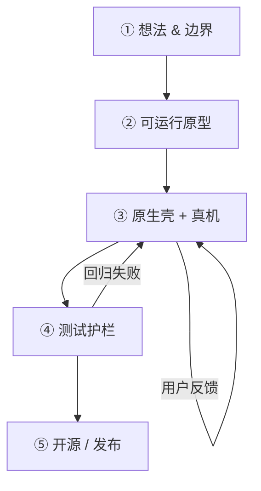

# Vibecoding 实践指南

> 基于 [Flow State](https://github.com/DuffyRen/flow-state) 项目沉淀的个人 vibecoding 流程。  
> 目标不是做爆款产品，而是跑通：**想法 → 可安装 App → 真机验证 → 测试护栏 → 开源发布**。

---

## 1. 什么是 Vibecoding（在这个项目里的定义）

**Vibecoding** = 用自然语言 + AI 快速迭代，靠「用起来对不对」驱动开发，再逐步补上工程化。

| 阶段 | 你在做什么 | AI 擅长 | 你必须亲自做 |
|------|-----------|---------|-------------|
| 原型 | 描述界面和交互 | 生成 HTML/CSS/JS | 确认「感觉对不对」 |
| 原生化 | 包成 .app | 写 Swift 壳、桥接 | 真机点一遍 |
| 修 bug | 截图 + 描述现象 | 定位、改代码 | 复现、验收 |
| 工程化 | 测试、CI、文档 | 写测试和脚本 | 决定测什么、何时发布 |

**核心原则：Vibe 负责速度，你负责验收。**

---

## 2. 推荐技术选型（小工具场景）

Flow State 验证过的组合：

```
┌─────────────────────────────────────┐
│  原生薄壳 (Swift / AppKit / WKWebView) │  ← 窗口、系统 API、性能敏感逻辑
├─────────────────────────────────────┤
│  业务 UI (单页 HTML + 内联 JS/CSS)    │  ← AI 迭代主战场
├─────────────────────────────────────┤
│  纯逻辑 (lib/*.js)                   │  ← 可单元测试、Node 可跑
└─────────────────────────────────────┘
```

**为什么这样选：**

- 不建 Xcode 工程 → AI 少胡编工程配置，一条 `swiftc` 就能构建
- Web 层改完 `./build.sh` 即见效果 → 反馈循环短
- 逻辑抽到 `lib/` → 测试不依赖浏览器

**不适合这套的场景：** 强系统能力（通知、菜单栏、iCloud 同步）、复杂动画、需要 App Store 分发。

---

## 3. 五阶段流程



### 阶段 ① 想法 & 边界（30 分钟）

- [ ] 用一句话说清：**谁、在什么场景、解决什么问题**
- [ ] 列出 **3 个必须有** 和 **明确不做** 的功能
- [ ] 选定平台（Flow State：macOS 13+ arm64）
- [ ] 选定数据方案（本地 `localStorage` / 文件 / 数据库）

**Flow State 范例：**

- 必须有：番茄钟、今日待办、桌面小组件
- 不做：账号、云同步、iOS 版、App Store 上架

---

### 阶段 ② 可运行原型（1～2 天）

- [ ] 单文件 HTML 能跑通主流程
- [ ] 界面能看、核心按钮能点
- [ ] 数据能存（刷新不丢）

**与 AI 协作提示：**

```
做一个 macOS 风格的番茄钟 + 待办单页，左右分栏，
数据用 localStorage，先不要原生壳。
```

**本阶段不要：** 追求完美 UI、写测试、考虑分发。

---

### 阶段 ③ 原生壳 + 真机验证（2～3 天）

- [ ] `native/main.swift` + `build.sh` 输出到 **`dist/xxx.app`**（不要写死桌面路径）
- [ ] JS ↔ Native 桥接约定写清楚（消息名、回调函数名）
- [ ] **每天用 10 分钟真实使用**，记录别扭之处
- [ ] 每个 bug：**截图 + 操作步骤 + 预期/实际**

**Flow State 在这个阶段踩过的坑：**

| 现象 | 根因 | 教训 |
|------|------|------|
| 选中待办后点完成无反应 | WKWebView 里 `-webkit-app-region: drag` 吞点击 | 交互区域必须 `no-drag`；优先事件委托 |
| 小组件计时不准 | `setInterval` 被 WebKit 节流 | 计时用墙钟 `Date.now()`，原生侧定期同步 |
| `syncTimerFromClock` 栈溢出 | `window.xxx` 与内部函数同名 | 桥接函数与内部实现**不同名** |
| 进度圆环方向反了 | `scaleX(-1)` 叠加 `rotate` | 改 UI 后对照截图验收 |
| `.icns` 生成失败 | 图标实际是 JPEG 却命名 `.png` | 发布前 `file` 命令确认格式 |

**与 AI 协作提示（修 bug）：**

```
我 11:28 开始专注，11:35 应过去 7 分钟，但显示只过去约 4 分钟。
小组件模式下更明显。请查计时是否依赖 setInterval。
```

---

### 阶段 ④ 测试护栏（1～2 天）

不必一开始就写满，但**开源前必须有**：

- [ ] `lib/` 纯逻辑 + **单元测试**（Node `node --test`）
- [ ] **静态检查**（必需 DOM、脚本引用、桥接关键字）
- [ ] **E2E 冒烟** 3～5 条即可（Playwright）
- [ ] `./test.sh` 一键跑全套
- [ ] CI（GitHub Actions on `macos-*`）

**Flow State 测试结构：**

```
tests/
├── unit/          # flow-tasks.test.js, flow-timer.test.js
├── static/        # check-html.js
├── e2e/           # smoke.spec.js
└── build/         # verify-swift.sh
```

**何时抽逻辑到 `lib/`：** 同一段计算/规则出现 **≥2 次**，或需要写单元测试时。

**本阶段已知局限：**

- E2E 跑 Chromium，**测不到** WKWebView 拖拽、节流、真桥接
- 计时准确性在小组件模式仍需 **人工抽测**

---

### 阶段 ⑤ 开源 / 发布（半天）

**发布前 Checklist：**

- [ ] `README.md`（中文）+ `README.en.md`（英文，可选）
- [ ] `LICENSE`（推荐 MIT）
- [ ] `CHANGELOG.md`
- [ ] 截图 2～4 张（`npm run screenshots` 或 Playwright 脚本）
- [ ] `gh auth login` 在本机 Terminal 完成（Cursor 内置 shell 可能读不到凭证）
- [ ] GitHub Release + `.zip` 安装包（arm64）
- [ ] Topics：`macos` `pomodoro` `productivity` 等

**构建发布包：**

```bash
./build.sh
cd dist && ditto -c -k --sequesterRsrc --keepParent "Flow State.app" "../Flow-State-v1.x.x-macos-arm64.zip"
gh release create v1.x.x --notes-file docs/release-notes-v1.x.x.md "Flow-State-....zip"
```

---

## 4. 与 AI 协作的提示词模板

### 新功能

```
在 Flow State 里加 [功能描述]。
约束：不改无关代码；逻辑能抽就放到 lib/；改完告诉我需要跑哪些测试。
```

### 修 bug（推荐格式）

```
现象：[截图或描述]
步骤：1. … 2. …
预期：…
实际：…
环境：展开模式 / 小组件 / 深色模式
```

### 发布前自检

```
对照 VIBECODING.md 阶段⑤ checklist，检查本仓库还缺什么。
```

---

## 5. 项目约定（Flow State 已采用）

### 目录

| 路径 | 职责 |
|------|------|
| `code_artifact.html` | UI + 业务（尽量控制体积，逻辑下沉 `lib/`） |
| `lib/` | 可测纯逻辑，IIFE 导出，Node 可 `require` |
| `native/main.swift` | 窗口、小组件、桥接、系统同步 |
| `build.sh` | 构建到 `dist/` 或 `$FLOW_STATE_APP_PATH` |
| `test.sh` | 单元 → 静态 → E2E → Swift 编译 |
| `docs/` | 架构、测试用例、截图、Release Notes |

### 桥接命名

```javascript
// ✅ 内部实现
function tickTimerFromWallClock() { ... }

// ✅ 暴露给 Native
window.syncTimerFromClock = () => {
    if (isRunning) tickTimerFromWallClock();
};
```

```swift
// Native → JS
webView.evaluateJavaScript("window.syncTimerFromClock?.();")
```

```javascript
// JS → Native
webkit.messageHandlers.flowState.postMessage({ action: 'collapse' });
```

### 计时器

- 使用 `createTimerEndAt` + `calcTimeLeftFromEnd`（墙钟）
- 小组件模式：原生 `Timer` 每秒 `syncTimerFromClock`
- 不要依赖 `setInterval(() => timeLeft--, 1000)` 作为唯一来源

---

## 6. 下次新项目可直接复制的脚手架

```bash
# 建议初始结构
my-tool/
├── app.html              # 或 code_artifact.html
├── lib/
├── native/main.swift
├── native/Info.plist
├── assets/app-icon.png
├── build.sh              # 输出到 dist/
├── test.sh
├── tests/unit/
├── tests/static/
├── tests/e2e/
├── .github/workflows/test.yml
├── README.md
├── LICENSE
└── VIBECODING.md         # 复制本文件改项目名
```

**Day 1 就应完成：**

1. `build.sh` → `dist/MyTool.app`
2. 3 条 E2E：打开、核心操作、关闭/重置
3. `.gitignore` 含 `dist/`、`node_modules/`

---

## 7. 当前 Flow State 的已知不足（诚实清单）

供下一个 vibe 项目避雷，也供本仓库后续迭代：

| 类别 | 不足 |
|------|------|
| 代码 | `code_artifact.html` 仍偏大；Tailwind CDN 依赖 |
| 测试 | E2E 非 WKWebView；无签名/公证自动化 |
| 产品 | 无系统通知、无数据导出、仅 arm64 |
| 流程 | 文档偶滞后于代码；长对话靠摘要续写易漏上下文 |

详见 [CHANGELOG.md](CHANGELOG.md) 与 [README 路线图](README.md#路线图)。

---

## 8. 相关文档

- [README.md](README.md) — 使用与构建
- [README.en.md](README.en.md) — English
- [docs/Flow State 技术架构.md](docs/Flow%20State%20技术架构.md)
- [docs/Flow State 测试用例.md](docs/Flow%20State%20测试用例.md)
- [.cursor/rules/flow-state.mdc](.cursor/rules/flow-state.mdc) — Cursor AI 项目规则

---

## 9. 一句话复盘

> **Vibecoding 的价值 = 用最小成本验证「我能独立交付一个完整软件」。**  
> Flow State 证明：一个人 + AI，可以走完原型、原生化、测试、CI、开源 Release 全链路。  
> 下一次不必从零摸索，照着本指南阶段 ①～⑤ 复制即可。
